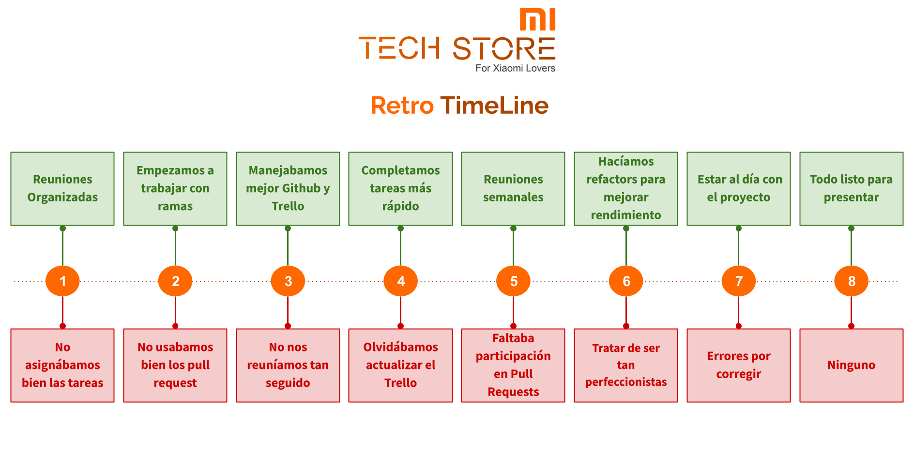

# Sprint 1
### 1. Comenzar a hacer:
Implementar el uso de ramas de Git para optimizar el trabajo y evitar conflictos.

### 2. Hacer más:
- Reunirse más seguido para coordinar mejor el trabajo.
- Agregar recursos necesarios para todos a las tareas en proceso y completadas del Trello.
- Verificar que se haya realizado los commit y los push al repositorio antes de pasar las tareas a la columna Done en Trello.

### 3. Continuar haciendo:
Continuar reuniéndonos los Martes y Jueves antes de la clase para coordinar el trabajo realizado y pendiente.

### 4. Hacer menos:
Evitar trabajar directamente todos en la rama main, sino más bien crear ramas por cada tarea y luego fusionarlas.

### 5. Dejar de hacer:
Evitar pasar tareas a la columna Done en Trello sin que se haya efectuado el push correspondiente en el repositorio. Esto permitirá mantener sincronizado todo el tiempo Trello y Github.

 

# Sprint 2

### 1. Comenzar a hacer:
- Trabajar con la rama main protegida
- Pasar las tareas a "To review" luego de hacer el pull request
- Incluir a todo el grupo dentro de los reviewers de los pull requests
- Establecer 2 aprobaciones mínimo para aprobar un pull request

### 2. Hacer más:
- Trabajar con ramas para guardar el main
- Extender el tiempo de las 2 reuniones semanales a 30 minutos

### 3. Continuar haciendo:
- Continuar reuniendonos 2 veces a la semana

### 4. Hacer menos:
- Dejar comentarios sobre las tareas por whatsapp y usar el Trello y Github para los pull request.

### 5. Dejar de hacer:
- Dejar de trabajar directamente en la rama main

 

# Sprint 3

### 1. Comenzar a hacer:
- Cerca del fin de los Sprint hacer una reunión para que cada uno explique cómo se hicieron las tareas del sprint.

### 2. Hacer más:
- Agregar fotos a los comentarios de los pull request.
- Ser más participativos en los reviews de los pull request.

### 3. Continuar haciendo:
- Trabajando en ramas y solicitando pull request.
- Reunirse mínimo 1 vez por semana.
- Seguir manteniendo actualizado el tablero de Trello.

### 4. Hacer menos:
- No mantener actualizado el Github y el Trello.

### 5. Dejar de hacer:
- Trabajar directamente en la rama main.
- No realizar la revisión de los pull request.

 

# Sprint 4

### 1. Comenzar a hacer:
- Revisar y probar con más calma cada pull request

### 2. Hacer más:
- Participar más en las revisiones de los pull request

### 3. Continuar haciendo:
- Continuar con la planeación y ejecución de tareas en el Trello
- Continuar trabajando en ramas y solicitando pull request
- Continuar reuniéndonos varias veces por semana

### 4. Hacer menos:
- Olvidarse de actualizar el estado de las tareas en el Trello

### 5. Dejar de hacer:
- Ninguna

 

# Sprint 5

### 1. Comenzar a hacer:
- Ninguna

### 2. Hacer más:
- Finalizar las tareas con mayor anticipación.
- Participar de los pull request.

### 3. Continuar haciendo:
- Seguir reuniéndonos semanalmente.
- Continuar trabajando con ramas y pull request.

### 4. Hacer menos:
- Ninguna

### 5. Dejar de hacer:
- Ninguna

 

# Sprint 6

### 1. Comenzar a hacer:
- Tratar de hacer refactor cuando se pueda para mejorar el rendimiento

### 2. Hacer más:
- Participar de los pull request.

### 3. Continuar haciendo:
- Finalizar las tareas con mayor anticipación.
- Seguir reuniéndonos semanalmente.
- Continuar trabajando con ramas y pull requests.

### 4. Hacer menos:
- Ninguna

### 5. Dejar de hacer:
- Ninguna

# Retro Final

